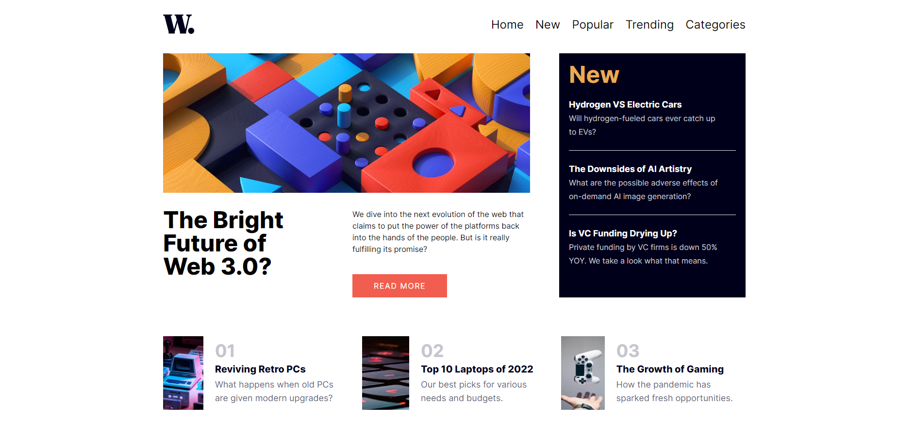

# New Homepage

## About project

This project consists of a small challenge of Frontend Mentor where there is a home page of a fictitious site. React, TypeScript, Tailwind CSS, Storybook and Prismic CMS were used here.
But the principal objective of the project was to start using the Prismic CMS and Storybook, so this is my first project that used these two tools.
Also was seen a some about componets.

\*\*Obs.: I didn't design the project for a mobile device.

## Technologies

-  React
-  TypeScript
-  Tailwind
-  Storybook
-  Prismic (CMS)

## Screens

### Site

